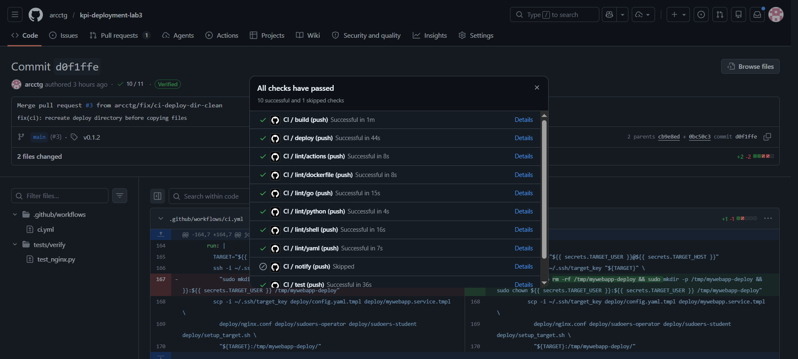
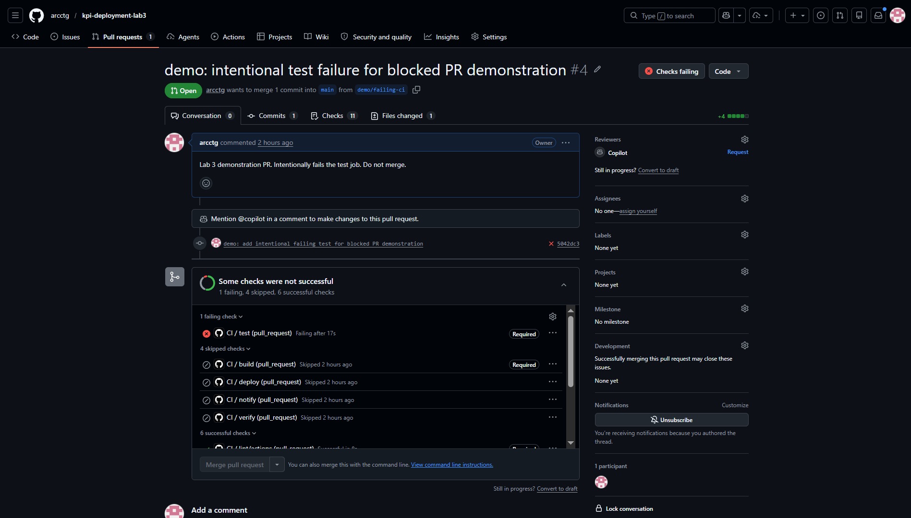
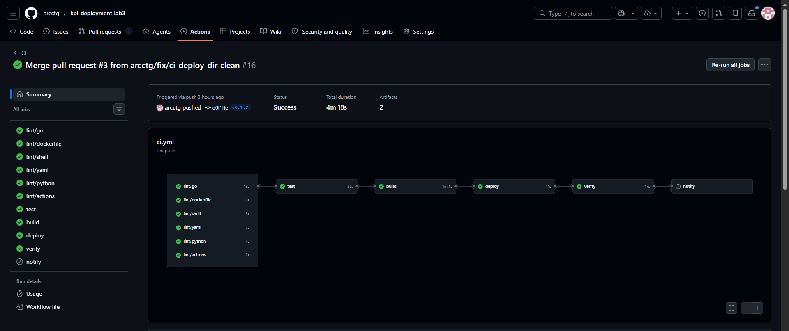
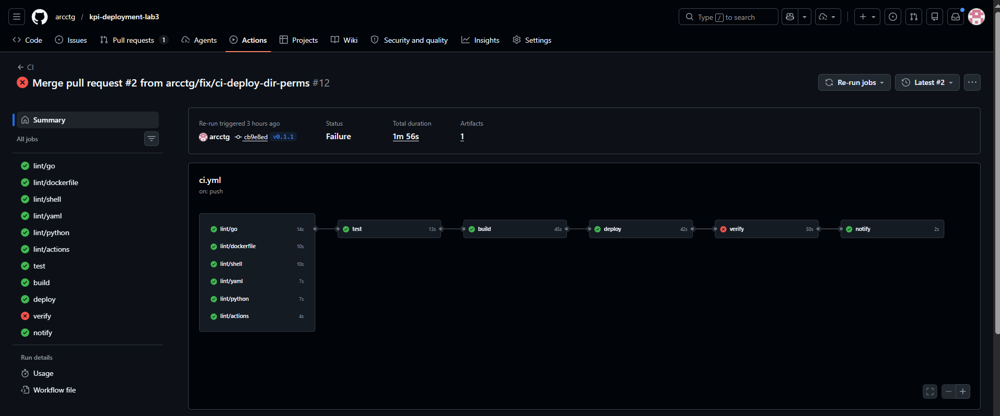
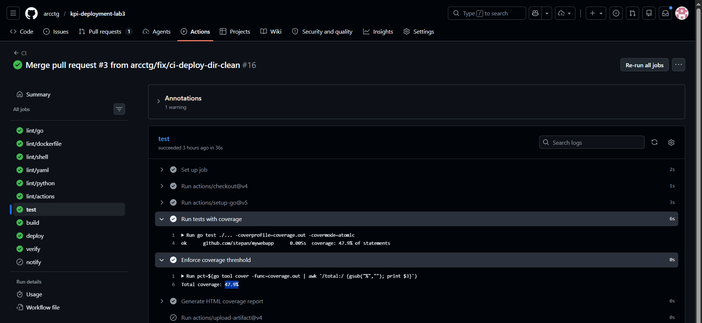
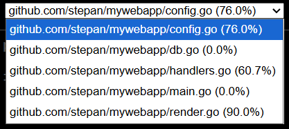

# Lab 3 report

| Item |Evidence |
|---|---|
| PR merged after all checks passed | [PR #3](https://github.com/arcctg/kpi-deployment-lab3/pull/3) |
| PR blocked by failing checks |  [PR #4](https://github.com/arcctg/kpi-deployment-lab3/pull/4) |
| Successful deploy + verify log | [Actions run v0.1.2](https://github.com/arcctg/kpi-deployment-lab3/actions/runs/26470282621) |
| Successful deploy  + failed verify log | [Actions run v0.1.1](https://github.com/arcctg/kpi-deployment-lab3/actions/runs/26469866153) |
| Coverage report artifact on `main` |  [main run artifact](https://github.com/arcctg/kpi-deployment-lab3/actions/runs/26470282621/artifacts/7224201335) |

## Pull requests

### Successful merge (all CI checks green)

- PR: https://github.com/arcctg/kpi-deployment-lab3/pull/3
- CI run on PR: https://github.com/arcctg/kpi-deployment-lab3/actions/runs/26470282621



### Blocked merge

- PR: https://github.com/arcctg/kpi-deployment-lab3/pull/4
- CI run on PR: https://github.com/arcctg/kpi-deployment-lab3/actions/runs/26471193981 (test job failed)



## CD pipeline runs

### Successful deploy and verify (tag `v0.1.2`)

Run URL: https://github.com/arcctg/kpi-deployment-lab3/actions/runs/26470282621

Jobs: deploy ✓, verify ✓ (13 passed), notify skipped



### Logs

[deploy text](docs/logs/deploy/deploy-logs-v0.1.2.txt)

[verify text](docs/logs/verify/verify-logs-v0.1.2.txt)

### Successful deploy + failed verify (tag `v0.1.1` rerun)

Run URL: https://github.com/arcctg/kpi-deployment-lab3/actions/runs/26469866153

Jobs: deploy ✓, verify ✗, notify ✓ (Telegram sent)



### Logs

[deploy text](docs/logs/deploy/deploy-logs-v0.1.1.txt)

[verify text](docs/logs/verify/verify-logs-v0.1.1.txt)

## Code coverage

- Threshold: >=40%
- Measured on main: 47.9%
- Artifact run: https://github.com/arcctg/kpi-deployment-lab3/actions/runs/26470282621
- Artifact name: `coverage-report` (`coverage.out`, `coverage.html`)
- HTML report: [docs/logs/coverage/coverage.html](docs/logs/coverage/coverage.html)





## CI pipeline

Workflow: `.github/workflows/ci.yml`

Required status checks (branch protection):

- `lint/go`, `lint/dockerfile`, `lint/shell`, `lint/yaml`, `lint/python`, `lint/actions`
- `test`, `build`


### Secrets

See [docs/SECURITY.md](docs/SECURITY.md).

Production credentials are stored in GitHub Secrets. The repository contains only templates (`deploy/*.tmpl`).

`teacher` and `operator` users always receive the Lab 1 default password `12345678` with mandatory change on first login.

### Infrastructure

| VM | Role | Setup |
|---|---|---|
| Target node | nginx, PostgreSQL, Docker app | [`deploy/setup_target.sh`](deploy/setup_target.sh) |
| Runner node | self-hosted GitHub Actions runner | [`deploy/setup_runner.sh`](deploy/setup_runner.sh) |

Detailed runner instructions: [docs/runner_setup.md](docs/runner_setup.md)

### Release (deploy)

```bash
git tag -a v0.1.0 -m "Release v0.1.0"
git push origin v0.1.0
```

### Notifications

Telegram bot setup: [docs/notifications.md](docs/notifications.md)
